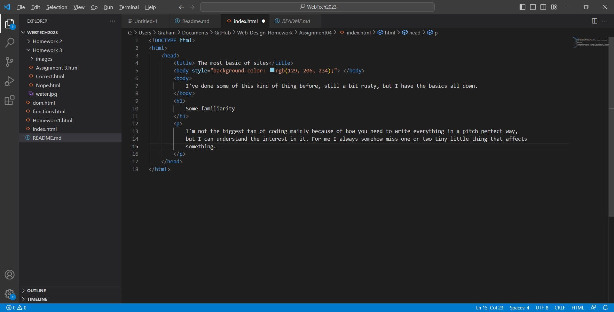

Web Browsers are how we get certain information from the web to display on your screen. This is done by putting in
the URL to send a request to the browser to find the information. Then it prepares to render and navigates to the URL's destination.
Finally after all that, it begins to render and display the page. 

I typically use Chrome as my browser, mainly because it's faster than others I've used and it's very handy for bookmarking and having
easy access for the sites I use. 

