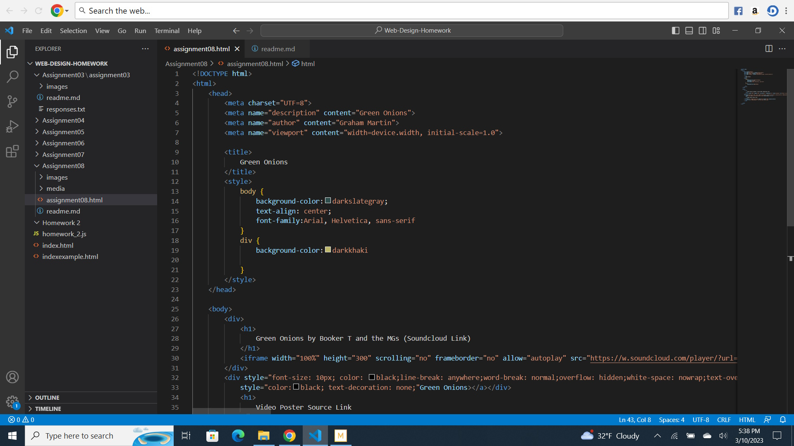

Affordances are what correlates a user's ability to use an object or action. 

Some of the advantages of using third party video services like Vimeo and Youtube is the uploading is already there on the site, it's less work to set it up, all you really need to do is link it. It can be even easier if you have a Youtube or Vimeo account and upload your own videos to your own site. However if you're borrowing another video, sometimes hosting a video can be complicated depending on the copyright usages the uploader used. Oftentimes they can delete the video and it won't show up on your site. 

Everything was pretty straightforward, the only thing I couldn't really do was get rid of the extra left and right space for the soundcloud link. I was following the directions on the tutorial, but whenever I typed out the margins and padding, Visual Code would mark them as errors. Not sure if it was because I'm using a newer version and they made some changes. Otherwise, everything was smooth sailing. 

 
