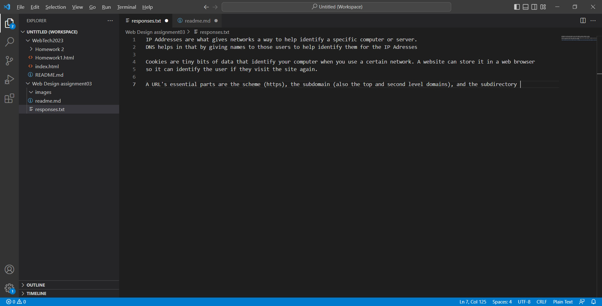

I've finally learned how to link images with a relative URL (if it'll work) I've also learned how to use different elements like italics and bold to emphasize some words 
in websites, and I've also learned how to use meta data to help a search engine identify the type of site I'm building

 

[responses](./responses.txt)
